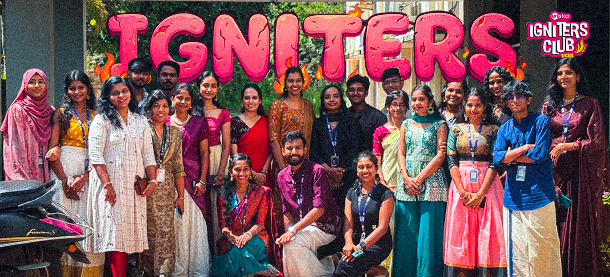

  

# Unstop Igniters UCEK 🔥

### India's 2nd Rank Top Performing Igniters Club | Empowering Careers Through Code & Community

---

## 🌟 Who We Are

We are **Unstop Igniters UCEK**—proudly established as the very first chapter of the Unstop Igniters Club, rooted at the University College of Engineering, Kariavattom (UCEK).

In just over a year since our inception, our driven community has scaled incredible heights, earning the **All India 2nd Rank as a Top Performing Igniters Club** nationwide. Our core mission is simple yet powerful: **driving quality placements, sharpening technical and soft skills, and unlocking real opportunities for students.**

---

## 🚀 Flagship Project: Impulse

### 🎓 UCEK Placement & Preparation Suite

Built exclusively for the students of UCEK, **Impulse** is our custom-crafted platform designed to bridge the gap between academic learning and corporate recruitment. It provides structured preparation resources, practice tools, and analytics to help students ace their interviews.

* **Core Tech:** `React` · `TypeScript` · `FastAPI` · `PostgreSQL` · `Redis` · `LLM Integrations`

---

## 🏆 What We Do & Events

We go beyond standard academics through high-impact events, technical workshops, and personality development programs:

* **🌟 Ignitia:** Our signature series designed to boost confidence, enhance soft skills, and help students transform into the best version of themselves. Under Ignitia, we’ve hosted:

  * **Ignitia Foundation:** Sessions focused on self-discovery, passion-building, and skill mapping.
  * **Interactive Competitions:** Engaging events like the Ignitia Treasure Hunt, Poster Making Competitions, and Selfie Contests.
* **💻 Technical Workshops:** Hands-on training sessions including our Python Workshop (Oct 14-15, 2025) and CAD Workshops to build practical engineering skills.
* **🎙️ Panel Discussions:** Flagship interactive sessions featuring top-tier industry panelists and experts.
* **🧭 Freshers' Onboarding & Official Unstop Mirror:** Serving as the official college mirror for Unstop to seamlessly connect students with nationwide hackathons and challenges.

---

## 🔗 Connect With Us

* **Instagram:** [@unstopigniters.ucek](https://www.instagram.com/unstopigniters.ucek)
* **LinkedIn:** [Unstop Igniters UCEK](https://www.linkedin.com/company/unstop-igniters-ucek)
* **Email:** [unstopignitersucek@gmail.com](mailto:unstopignitersucek@gmail.com)
* **GitHub:** [Unstop-Igniters-UCEK](https://github.com/Unstop-Igniters-UCEK)

  <i>Building pathways to success—one placement, one student at a time. 🚀</i>

